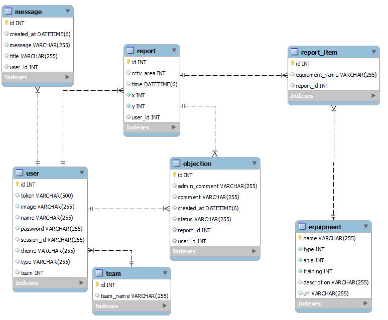
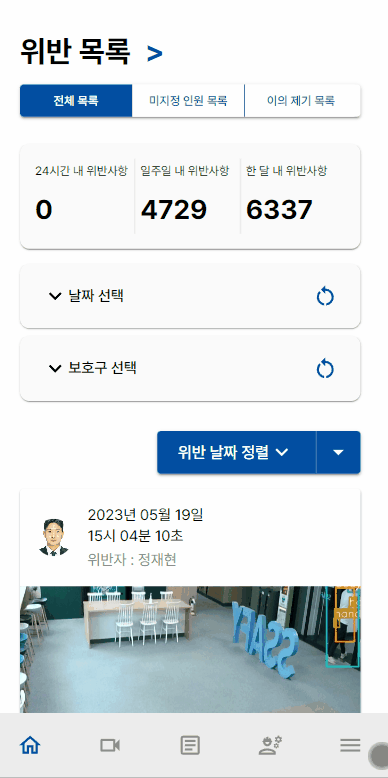

# 🚨 DETECTO

### 목차

1. **[서비스 소개](#1-서비스-소개)**
2. **[기술 스택](#2-기술-스택)**
3. **[주요 기능](#3-주요-기능)**
4. **[프로젝트 구성도](#4-프로젝트-구성도)**
5. **[구현 화면](#5-구현-화면)**
6. **[팀 소개](#6-팀-소개)**
7. **[실행 방법](#7-실행-방법)**

---

## 1. 서비스 소개

**“OpenCV를 이용해 실시간으로 보호구 미착용자를 감지, 관리하는 시스템”**

Detecto는 OpenCV를 활용하여 보호구 미착용을 실시간으로 감지하는 프로젝트입니다. CCTV를 통해 실시간으로 근로자들의 보호구 착용 여부를 모니터링하며, 만약 위반 사항이 발견되면 즉시 관리자에게 알림을 보냅니다.

또한 대시보드를 제공하여 감지된 위반 사항에 대한 통계를 집계하고 시각화합니다. 이를 통해 관리자는 보호구 미착용 위반의 패턴을 파악하고, 더 효과적인 관리 방안을 마련할 수 있습니다.

더 나아가 Detecto는 PWA(Progressive Web Application)를 이용한 알림 시스템과 모바일 반응형 페이지를 통해 사용자들이 어디에서든지 쉽게 이용할 수 있도록 제공합니다. 이를 통해 보다 신속하게 위반 사항을 인지하고 적절한 조치를 취할 수 있습니다.

<br/>

## 2. 기술 스택

<table align="center">
  <tr>
    <td align="center" width="165"><strong>Frontend</strong></td>
    <td>
      <div>
        
        
        
        <br/>
        
        
        
        <br/>
        
        
        
        <br/>
      </div>
    </td>
  </tr>
  <tr>
    <td align="center" width="165"><strong>Backend</strong></td>
    <td>
        
        <br/>
        
        <br/>
        
        <br/>
        
    </td>
  </tr>
  <tr>
    <td align="center" width="165"><strong>AI</strong></td>
    <td>
        
        <br/>
        
        <br/>
    </td>
  </tr>
  <tr>
    <td align="center" width="165"><strong>Infra</strong></td>
    <td>
        
        <br/>
        
        <br/>
        
        <br/>
        
        <br/>
        
    </div>
  </tr>
<table>

<br/>

## 3. 주요 기능

### 3. 1. 보호구 감지


- YOLOv8 모델을 활용해 보호구(안전모, 보안경, 앞치마, 팔토시, 보호장갑 등) Object Detection

### 3. 2. CCTV 실시간 스트리밍 및 다시보기

- 작업자들의 보호구 착용 여부를 감지하는 CCTV 영상

<table>
<tr>
  <td>
      
  </td>
  <td>
      
  </td>
</tr>
</table>

    1) CCTV 데이터 파이프라인
      1-1) Kafka 를 이용한 데이터 클러스터링
        - Partition 을 이용해 일자별 데이터 구분
    2) CCTV 데이터 전송 과정
      2-1) 연결
        - WebSocket 을 이용해 클라이언트 연결 유지
      2-2) 데이터 전달
        - 클라이언트 Progress Bar 를 100이라고 할 때,
        - CCTV 별 전체 이미지 개수로 나누어 해당 위치에 맞는 위치(offset) 조정 및 전달에 따라서 해당 위치부터 다시 전달(Consume Message)
        - 이후 Maxoffset과 image를 0.1초 간격으로 보내 10 FPS 영상을 구현하고 실시간으로 동영상 최대 길이를 갱신
      2-3) 실시간, 일시정지 기능
        - 클라이언트에서 특정 행동(실시간, 일시정지 등)을 취할 시 각 행동에 대한 코드값을 부여해 서버에서 별도 로직 처리

<br/>

### 3. 3. 보호구 추가 및 삭제 학습 등록


- 관리자가 라벨링한 이미지 데이터를 zip파일로 첨부
- Flask 서버에 업로드 하면 OpenCV를 통해 라벨링 이미지를 학습 후 보호구 감지에 반영할 수 있음
- 학습률을 실시간으로 조회해 관리자는 해당 보호구의 학습률을 인식할 수 있음

### 3. 4. 대시보드

- 그래프 데이터 구성
  - 서버에서 기간별 전체 데이터를 조회
  - d3.group, d3.rollup을 이용해 기간, 보호 장비, 팀별로 데이터를 그룹핑
- 그래프 구현
  - SVG 요소를 useRef를 이용해 지정해 useEffect로 랜더링 시 d3를 이용해 차트를 구성
  - SVG 리사이징은 useResize 커스텀 훅을 이용해 window resize이벤트가 발생할 때 부모 요소의 width를 측정해 SVG width에 반영

### 3. 5. 알림기능

- 프론트 애플리케이션은 표준 API인 Push API와 Notification API를 활용하여 push 알림 기능을 구현하였음
- 모든 push 알림 관련한 설정 및 객체 생성 과정은 유저의 인증상태가 인가되었을 때에만 진행되도록 함:

  ```tsx
  /* AuthProvider.tsx */
  function AuthProvider({ children }: AuthProviderProps) {
  	const getSubscription = usePush();
  	...
  	const sendSubscription = async () => {
      try {
        const [endpoint, p256dh, auth] = await getSubscription() ?? [];
  			// 구독 객체가 성공적으로 생성되었다면, 이를 서버에 전송함
  			...
  		}
  	}
  }

  ```

- 백그라운드 상에서 push 이벤트를 감지하기 위해 service worker를 사용하였음:

  ```jsx
  /* service-worker.js */
  const pushHandler = (event) => {
    const { title, body } = event.data.json();
    const options = {
      body: body,
      icon: "/icons/icon-512x512.png",
      vibrate: [100, 50, 100],
      data: {
        dateOfArrival: Date.now(),
      },
      actions: [
        {
          action: "confirm",
          title: "확인",
        },
        {
          action: "close",
          title: "닫기",
        },
      ],
    };
    event.waitUntil(self.registration.showNotification(title, options));
  };

  self.addEventListener("push", pushHandler);
  ```

- 유저의 인증상태가 인가되면 service worker 생성여부를 점검하고, 생성되지 않았을 경우 정해진 로직에 따라 service worker를 생성하고 브라우저에 등록함:
- service worker가 등록된 이후에는 미리 생성한 VAPID의 공개키를 활용하여 구독 객체를 생성함. 이때 구독 객체는 웹 브라우저 벤더에 의해 공급되는 push 서비스로 구독하였음:
  ```jsx
  /* usePush.tsx */
  const subscription = await registration.pushManager.subscribe({
    userVisibleOnly: true,
    applicationServerKey: "VAPID 공개키 값",
  });
  // ...
  ```

### 3. 6. 근로자 위반 사항 관리

- 근로자 위반 사항을 기간별, 보호구별로 조회 가능
- 표(테이블) 형식으로 데이터를 제공
- 모바일에서는 카드와 바텀시트 형식을 이용
- 사원의 얼굴이 인식이 되지 않았더면 미지정 인원 목록에서 해당 근로자를 다시 지정할 수 있음

### 3. 7. 근로자 이의 제기 및 관리

- 근로자가 자신의 위반사항을 조회 가능
- 자신의 위반사항이 아닐 경우 이의 제기
- 관리자는 이의 제기한 사항에 대해 인원 재지정, 이의 거절, 위반 항목 삭제를 할 수 있음

<br/>

## 4. 프로젝트 구성도

### 4. 1. 시스템 아키텍처 (System Architecture)


### 4. 2. 개체-관계 모델 (ERD)



## 5. 구현 화면

### 5.1. 로그인 화면


- 일반 사용자를 대상으로 하는 서비스가 아니기 때문에 중앙에서 관리를 위해 세션방식으로 구현

### 5.2. 보호구 위반자 관리

#### 5.2.1. 위반자 조회

<table>
<tr>
  <td>
      
  </td>
  <td>
      
  </td>
</tr>
</table>

    1) 보호구 미착용과 근로자의 얼굴인식을 통해 위반자를 지정
    2) 위반 사원의 경우 해당 시간 근무한 팀의 팀원을 드롭다운 형식으로 조회 가능
    3) 사원을 드롭다운에서 선택하면 해당 사원으로 위반사원을 지정 가능
    4) 모바일 화면에서는 표(테이블)형식으로 인지하기 어렵다고 생각해 카드형식으로 위반 사항을 배치
    5) 카드를 터치하면 바텀시트로 상세 정보가 나오도록 구현

#### 5.2.2. 미등록 위반자 조회


- 위반자의 얼굴이 감지되지 않을 경우 미등록으로 위반자를 지정
- 관리자가 사진을 확인하고 위반자를 직접 지정할 수 있음

#### 5.2.3. 이의 제기 관리

- 근로자의 얼굴인식이 잘못 되었거나 본인이 아닐경우 이의제기
- 이의제기를 수락하거나 거절할 수 있음


#### 5.2.3. 실시간 CCTV

<table>
<tr>
  <td>
      
  </td>
</tr>
<tr>
  <td>
      
  </td>
  <td>
      
  </td>
</tr>
</table>

- 카프카를 이용한 웹소켓 통신으로 실시간으로 base64형식의 이미지를 받아와 Image객체를 새로 생성
- img요소의 src를 지속적으로 Image객체로 바꿔주며 영상처럼 구현
- **동영상 플레이어**와 동일하게 조작할 수 있도록 구현

<br/>

#### 5.2.4. 대시보드

<table>
<tr>
  <td>
      
  </td>
  <td>
      
  </td>
</tr>
</table>

- D3.js를 통해 그래프 및 차트 생성

(구현 후 삭제)

<table>
<tr>
  <td>
      
  </td>
  <td>
      
  </td>
</tr>
</table>

- CCTV이미지를 기반으로 근로자의 좌표를 계산
- 위반 좌표를 Scatter차트로 위반 항목 위치를 보여줌

#### 5.2.5. **보호구 추가 및 삭제**

<table>
<tr>
  <td>
      
  </td>
  <td>
      
  </td>
</tr>
</table>

- 학습 시킬 이미지가 들어있는 zip파일을 첨부한 뒤 제출
- 플라스크 서버에서 OpenCV를 이용해 이미지를 학습 후 보호구 미착용 검출에 반영

### 6. 실시간 알림


- Push API, Notification API, PWA를 이용해 백그라운드 service worker에서 작동하도록 구현

### 7. 근로자 페이지

- 근로자 위반 사항 확인 및 이의제기
  

- 근로자 이의제기 확인
  

<br/>

## 6. **팀 소개**

<table>
<thead>
  <tr>
    <th>이름</th>
    <th>역할</th>
    <th>개발 내용</th>
  </tr>
</thead>
<tbody>
  <tr>
    <td>성광현</td>
    <td>팀장<br/>Backend (python)<br/>AI (Yolov8)</td>
    <td>
      <strong>Backend</strong><br/>
      - flask 서버 구축<br/>
      - ORM 연결<br/>
      - AI 처리의 프레임 개선을 위한<br/>
      <br/>
      <strong>AI</strong><br/>
      - Yolo 라이브러리 커스텀<br/>
      - 데이터 학습 (12만 장)<br/>
      - 객체별 위반 보호구 감지
      <br/>
    </td>
  </tr>
  <tr>
    <td>이석원</td>
    <td>Backend<br/>Infra</td>
    <td>
      <strong>Backend</strong><br/>
      - web API 구현<br/>
      - JPA를 통한 DB 설계<br/>
      <br/>
      <strong>Infra</strong><br/>
      - Docker, Jenkins, Ansible을 통한 CI/CD 파이프라인 구축<br/>
      - Nginx에 프론트엔드 배포 및 리버스 프록시<br/>
      - HTTPS SSL 인증
      <br/>
    </td>
  </tr>
  <tr>
    <td>정재현</td>
    <td>Data Pipe Line<br/>Backend</td>
    <td>
      <strong>Data PipeLine</strong><br/>
      - Kafka 를 이용한 CCTV 데이터 파이프라인 구축<br/>
      <br/>
      <strong>Backend</strong><br/>
      - Kafka, FastAPI 를 이용한 CCTV 기능 구현<br/>
      - 웹 소켓을 이용해 CCTV 기능을 이용하는 클라이언트와 연결 유지
      <br/>
    </td>
  </tr>
  <tr>
    <td>윤소현</td>
    <td>Frontend<br/>AI (Yolov8)</td>
    <td>
      <strong>Frontend</strong><br/>
      - 와이어프레임 및 프로토타입 설계<br/>
      - 작업자 이의제기 페이지 제작<br/>
      - 작업자 위반사항 페이지 제작<br/>
      - Emotion, mui 이용한 UI 제작<br/>
      <br/>
      <strong>AI</strong><br/>
      - 데이터 학습 및 라벨링<br/>
      - Flask 서버 모듈화
      <br/>
    </td>
  </tr>
  <tr>
    <td>배상준</td>
    <td>Frontend</td>
    <td>
      <strong>Frontend</strong><br/>
      - 대시보드 차트 구현(d3.js)<br/>
      - 위반사항 페이지 구현<br/>
      - 웹소켓 통신 및 CCTV 구현<br/>
      - 반응형 UI 구현
      <br/>
    </td>
  </tr>
  <tr>
    <td>이용훈</td>
    <td>Frontend</td>
    <td>
      <strong>Frontend</strong><br/>
      - 프론트 앱 환경설정 담당<br/>
      - 라우팅 담당<br/>
      - PWA 기능 구현<br/>
      - 유저 인증 처리과정 담당<br/>
      - 비동기 요청 처리 담당<br/>
      - 네비게이션바, 보호구 관리 페이지 구현 담당
      <br/>
    </td>
  </tr>
</tbody>
</table>

## 7. 실행 방법

- 프로젝트의 exec 폴더 내 포팅 매뉴얼 참조
